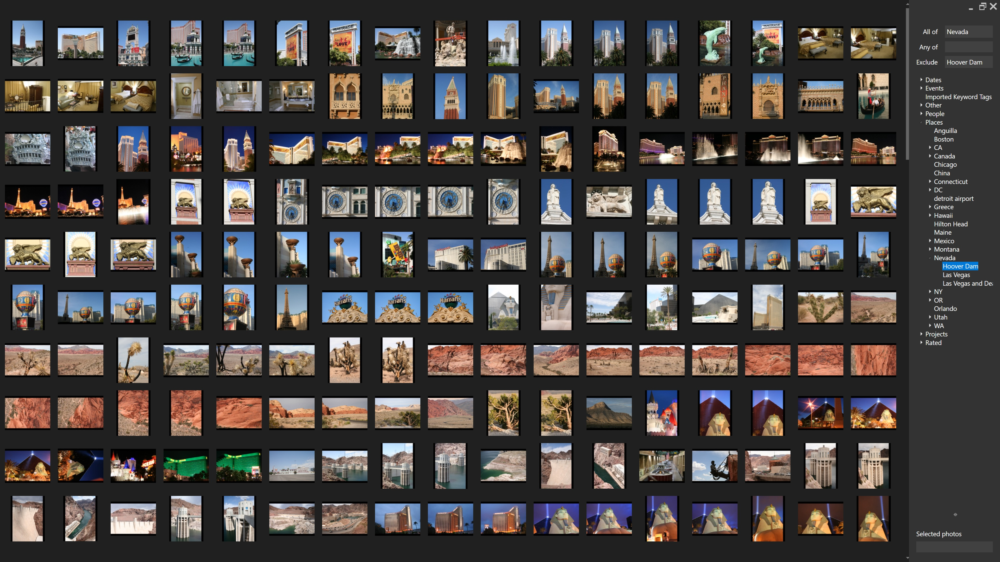
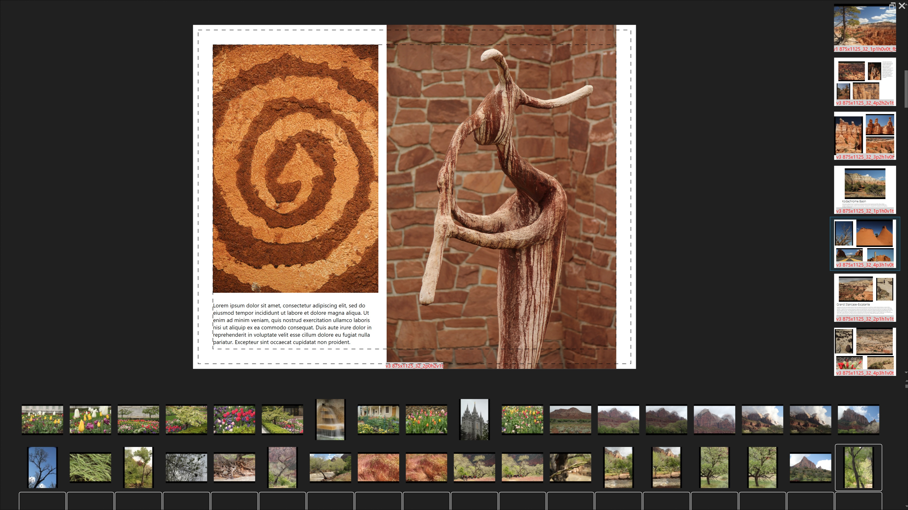
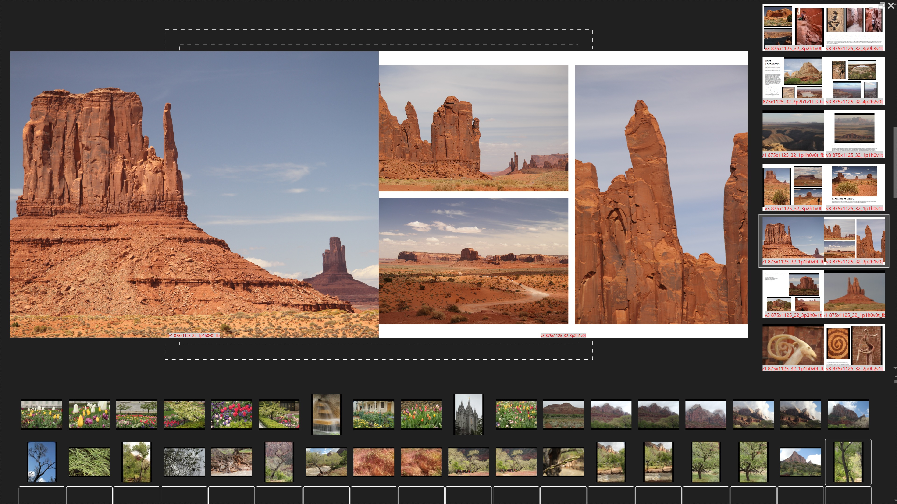

# Folio

**Organize your photos. Create beautiful books.**

Folio helps you curate your photo collection and transform your best shots into professionally designed photo books ready for print. What sets it apart is the immersive, full-screen environment where your photos take center stage — no toolbars, no clutter, just your images. Navigate efficiently through keyboard shortcuts, experience buttery-smooth transitions, and work in a space purpose-built for visual content.

## Features

### Library 
Your complete photo catalog displayed as a high-density grid. Apply tags to organize your collection, then filter by those tags to find exactly what you're looking for. 

*Tag-based filtering and high-density grid layout*

### Slideshow
Full-screen, distraction-free photo viewing. Navigate with arrow keys, mark favorites as you browse, and make initial selections without leaving the viewing experience. Perfect for reviewing recent imports or presenting portfolios.

*Full-screen viewing with zero UI chrome*

### Page Designer
Turn photo collections into print-ready photo books. Choose from professionally designed templates that intelligently combine images and text. Export print-ready files ready to send to a print shop for binding.

*Professional templates ready for print*

*Go full screen*

*Two-page spread view*

## What Makes Folio Different

**100% of your pixels, 0% chrome**  
Folio runs fullscreen by default with no toolbars, window borders, or menus competing for space. Your photos get the entire display. Navigation happens through keyboard shortcuts and context menus—right-click anywhere to access controls, or hit `?` to see available shortcuts.

**Keyboard first interface**  
Folio assumes you're serious about your photos and familiar with keyboard-driven workflows. Rather than hand-holding with visible UI elements, it stays out of your way until you need it. The result is an app that feels responsive, focused, and respectful of your screen real estate.

**Instant, preloaded transitions**  
The slideshow engine preloads upcoming photos so advancing to the next image happens with zero delay. Smooth, purposeful animations between slides help you perceive the difference between consecutive images without breaking your flow.

**Design your book once, print at any size**  
Layouts seamlessly adapt to the available space, so you can seamlessly take your book to a different printer who uses different paper size.

**All data is stored as text**  
So you can put your photo projects under version control.

## License

Copyright Nick Kramer 2025, all rights reserved.
