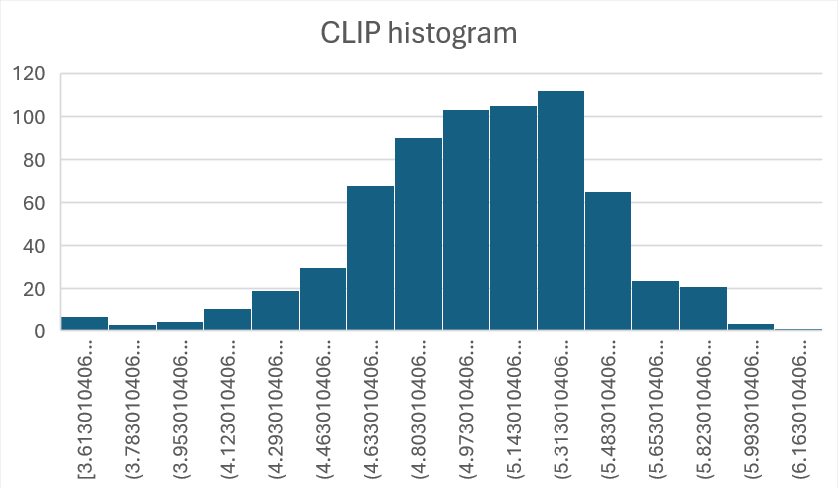
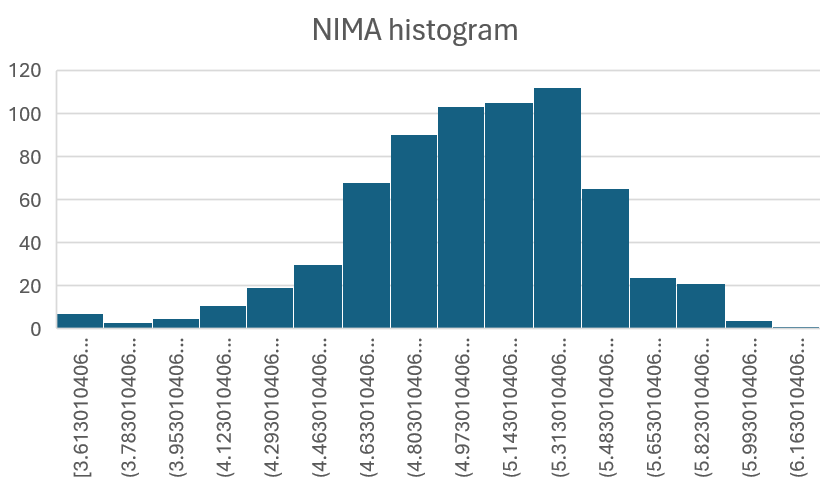

# Failed experiment: Automatic assessment of image quality

I tried several different ML models that assess image quality. They had some predictive value, The scores were better than random, but not enough better to make any real difference on workflow. I would regularly find good photos rated as garbage, and terrible photos rated as good.

I tried four models:
- **CLIP-IQA** – Assesses image esthetics rather than technical quality (blur, noise, etc). CLIP-IQA was the best of the bunch but it was also the slowest, taking several hours to go through 700 photos. CLIP ranks from 0 to 1.0, higher is better. According to Claude, 0.75 is Good quality, 0.5 Is average, and 0.25 is poor quality. I tested on 668 photos from Sedona AZ, which rated from 0.221 to 0.684. My average picture was 0.490, median was 0.499.
 


- **NIMA** – Not quite as good as CLIP but way faster, If memory serves it was more like 15 minutes than three hours to score those photos. Higher scores are better. According to Claude, average photos score a 5.5-7.0. My ratings ranged from 3.61 to 6.32. My average picture was a 5.10, median 5.14. The correlation between NIMA and CLIP was only 0.10. In theory, NIMA Is a blend of esthetic and technical consideration, but I didn’t see the technical part.
 


- **BRISQUE** – Was useless. It’s supposed to measure technical quality rather than esthetic, but I couldn’t see much rhyme or reason to its scores.

- **MUSIQ** – Didn’t work on my 32gb machine, It caused the computer to thrash from low memory.

In theory, you should be able to use imperfect measures to rule out the clear losers and highlight High potential photos. But in the end I don’t see a practical way to use this. 
One approach would be to use CLIP/NIMA to rule out the clear losers. However, I don’t think you could trust it to eliminate more than 10%, and if we’re only talking about A 10% increase in productivity I’d rather look at the mall and be sure of what I get.
Another approach would be to highlight the top 10 percent for extra human review. But again, There’s going to be a ton of great photos that CLIP and NIMA miss, so I’m going to have to look at most of the photos anyway, so I’m not sure there’s really any room to review them extra.

A couple possibilities that might work: 
- Sort photos by CLIP/NIMA, and decrease the amount of time you spend on each image as 
  the scores get lower.
- Use another model to cluster similar photos together, then use CLIP/NIMA to pick the
  best within each cluster. Categorizing photos with object detectors 
  (especially people detectors) might also help rate photos. 
  Although I think the real value of that approach is making tagging easier. 

To use CLIP/NIMA:

```
pip install pyiqa torch pandas tqdm

import pyiqa
import torch
from pathlib import Path
import pandas as pd
from tqdm import tqdm

# Setup device
device = torch.device("cuda" if torch.cuda.is_available() else "cpu")
print(f"Using device: {device}")

# Create metrics
print("Loading metrics...")
nima_metric = pyiqa.create_metric('nima', device=device)
brisque_metric = pyiqa.create_metric('brisque', device=device)
clipiqa_metric = pyiqa.create_metric('clipiqa', device=device)

for img_path in tqdm(jpeg_files, desc="Processing images"):
        nima_score = nima_metric(str(img_path)).item()
        clip_score = clipiqa_metric(str(img_path)).item()
```

Heck to turn spreadsheet results into an HTML file you can view:
```
=CONCAT(""))
```

Generates
```

```

